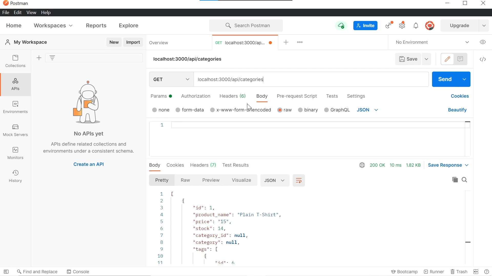

  # E-Commerce Back End

  
  

      

  ### Table of Contents
  [Description](https://github.com/DeviantSchemist/E-CommerceBackEnd#description)

  [Installation](https://github.com/DeviantSchemist/E-CommerceBackEnd#installation)

  [Usage](https://github.com/DeviantSchemist/E-CommerceBackEnd#usage)

  [Contribution](https://github.com/DeviantSchemist/E-CommerceBackEnd#contribution)

  [Tests](https://github.com/DeviantSchemist/E-CommerceBackEnd#tests)

  [Questions](https://github.com/DeviantSchemist/E-CommerceBackEnd#questions)

  ## Description
  A back end system for an e-commerce website. Users can have their data models brought to life via sequelize and express. Various routes are given for users to navigate their data model.

  ## Installation
  Have node.js installed on a text editor/IDE of your choice. Install the necessary npm packages that are listed in the package.json file. Install the dependencies by running this command: npm i [dependency name], you can have multiple dependencies installed at the same time by separating each dependency with a space.

  ## Usage
  Make sure to create the database with name "ecommerce_db" in your MySQL program. Then, go to your text editor/IDE and open up the terminal. Then type in this command "npm run seed" in order to fill your database. Afterwards, run "npm start" and your server should be running. Then, use either Insomnia Core or Postman in order to view your api routes and see your seeded data.

  ## Contribution
  Clone this repository. Then make a branch name based on what feature you want to implement. After you have tested its functionality, submit a pull request for review.

  ## Tests
  Follow the routes files in order to see how to formulate your api requests.

  ## Screenshot
  

  ## Video
  [Demo](https://youtu.be/IFacPxC_8gw)

  ## Questions
  If you have additional questions, please see below for my contact information.

  Github: [deviantschemist](https://github.com/deviantschemist)

  Email: michaelngo1337@yahoo.com
  